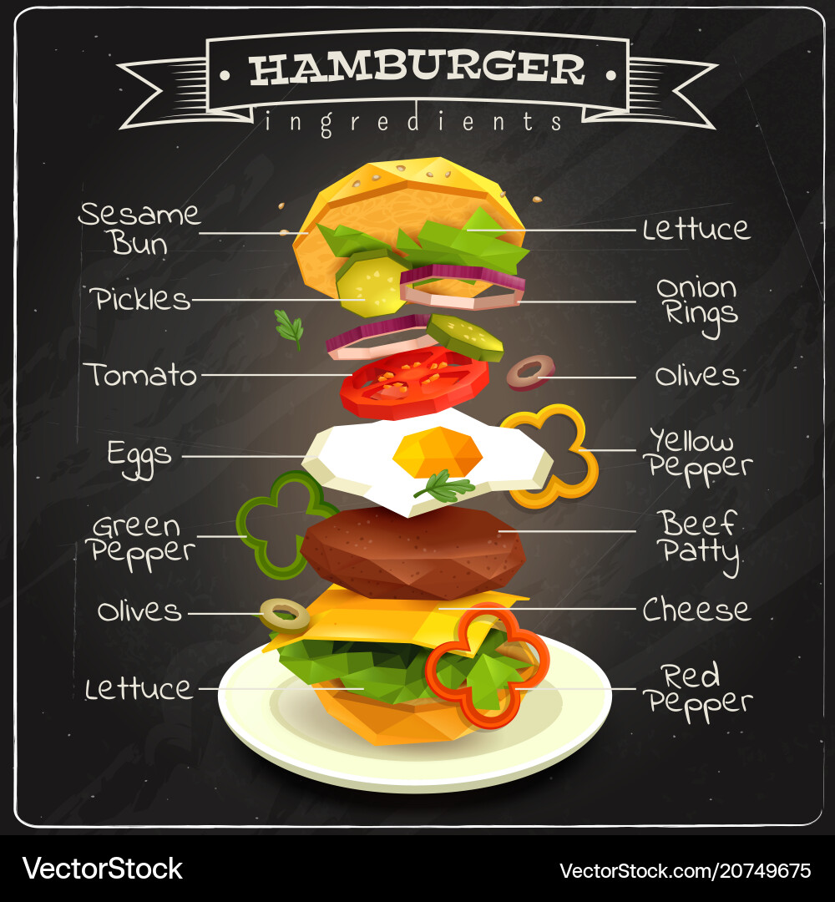
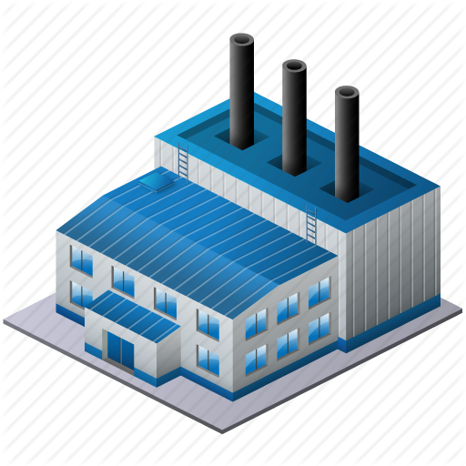

## Authors

- [@Inal Karakhanli](https://www.github.com/nickforhuman)

# DesignPatterns

## Builder
🇦🇿 Azərbaycan dilində 

Təsəvvür et ki, sən bir restoranın mətbəxindəsən və müştəri öz zövqünə uyğun bir hamburger istəyir. Biri pendir istəyir, biri istəmir. Biri sous əlavə etdirir, digəri isə sadə istəyir. Bu vəziyyətdə hər müştəriyə uyğun hamburger hazırlamaq üçün Builder Dizayn Şablonu mükəmməl işləyir.
🧱 Builder Şablonunun Rolları:

    Product (Məhsul) – Hamburger
    Hazırda müştəriyə təqdim ediləcək son məhsuldur.

    Builder (Qurucu) – Hamburgeri addım-addım yığan struktur.
    Məsələn, add_bun(), add_patty(), add_cheese(), add_lettuce() kimi metodları var.

    ConcreteBuilder (Həqiqi Qurucu) – Məsələn, BigMac, Toyuq Burger və s.
    Fərqli burger növləri bu builder vasitəsilə hazırlanır.

    Director (İdarəçi) – Ofisiant
    Hansı növ hamburger istənildiyini bilir və builder’a nəyi necə hazırlamalı olduğunu deyir.

    1. add_bun()     → Çörək qoyulur
    2. add_patty()   → Ət köftəsi əlavə olunur
    3. add_cheese()  → Pendir istənilirsə əlavə edilir
    4. add_lettuce() → Kahı əlavə edilir
    5. add_sauce()   → Sous əlavə edilir
    6. build()       → Hamburger tamamlanır

🇬🇧 English Explanation

Imagine you're in a restaurant kitchen, and a customer wants a custom hamburger. One wants cheese, the other doesn’t. One adds sauce, another prefers it plain. In this case, using the Builder Design Pattern helps construct flexible burgers step by step.
🧱 Roles in the Builder Pattern:

    Product – The Hamburger
    This is the final product that will be served to the customer.

    Builder – Responsible for building parts of the hamburger step by step.
    It includes methods like add_bun(), add_patty(), add_cheese(), add_lettuce(), etc.

    ConcreteBuilder – For example, BigMacBuilder, ChickenBurgerBuilder
    These are different builders to create different burger types.

    Director – The Waiter
    Knows what the customer wants and instructs the builder how to prepare the hamburger.

      1. add_bun()     → Add the bun
      2. add_patty()   → Add the meat patty
      3. add_cheese()  → Add cheese if requested
      4. add_lettuce() → Add lettuce
      5. add_sauce()   → Add sauce
      6. build()       → Return the completed hamburger

## Factory

🇦🇿 Azərbaycan dilində izah 

Factory Dizayn Nümunəsi (ing. Factory Design Pattern) — bu, yaradıcı (creational) dizayn nümunəsidir. Məqsədi, obyektlərin yaradılmasını bir funksiyaya ötürmək və proqramın əsas hissəsini bu detaldan ayırmaqdır.

Bu nümunə fərqli növ obyektləri dinamik şəkildə yaratmaq istədikdə çox yararlıdır.

 ### Sadə Fikir

    Factory pattern = "Nə istehsal olunacağını bilmirsən, amma necə istehsal ediləcəyini bilirsən."

🇬🇧 English Explanation 

The Factory Design Pattern is a creational design pattern that provides an interface for creating objects in a superclass, but allows subclasses to alter the type of objects that will be created.

It’s useful when:

    You don’t know in advance what class of object you need.

    You want to isolate object creation logic from usage.

